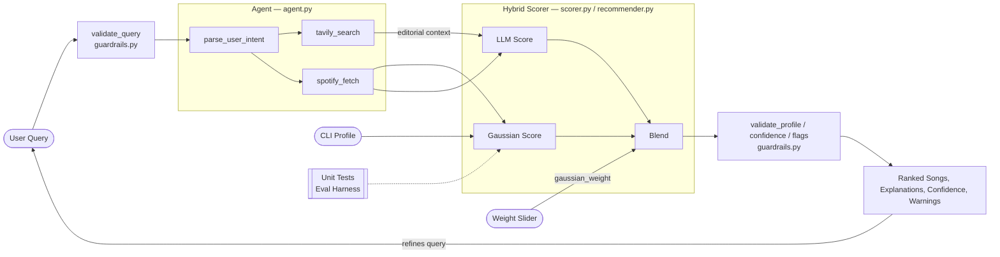

# 💽 OpenFM-agent

## Project Summary

**Original**: Music Recommender Simulation: https://github.com/10xdaemon/cp-proj3-Music

**OpenFM** started as a scoring based music recommender that ranks a static 20 song catalog against a structured user taste profile. It uses genre matching, a mood adjacency graph, and Gaussian proximity across four audio features **[energy, tempo, acousticness, speechiness]** to produce a ranked playlist from a fixed dataset. The system was built to explore how small design decisions, like a single point bonus, can quietly shape every result.

**NOW**, it got an AI powered evolution. In **OpenFM**, the static catalog and CLI profile were replaced with real Spotify song fetching, a 5 step Claude agentic loop, a RAG pipeline that pulls live editorial context to inform scoring, and a hybrid scorer that blends the original Gaussian algorithm with LLM semantic evaluation.

---

## Architecture Overview

The pipeline starts with a natural language query. Claude's agent parses intent into a structured taste profile, then runs two parallel tools: `tavily_search` retrieves live editorial context from the web (the RAG step), and `spotify_fetch` retrieves 10 candidate tracks. Both outputs feed the hybrid scorer — the Gaussian scorer uses audio feature proximity, the LLM scorer uses Claude's semantic judgment weighted against that editorial context. A user controlled slider (`gaussian_weight`) sets the blend. Guardrails run on both ends: input validation before the agent, confidence scoring and bias flags after the blend.

## System Architecture



---

## Setup

**Prerequisites:** Python 3.10+, API keys for Anthropic, Tavily, and Spotify (Client ID + Secret).

1. Clone the repository and navigate to `applied-ai-system-final/`

2. Create a virtual environment:
   ```bash
   python -m venv .venv
   source .venv/bin/activate      # macOS/Linux
   .venv\Scripts\activate         # Windows
   ```

3. Install dependencies:
   ```bash
   pip install -r requirements.txt
   ```

4. Copy `.env.example` to `.env` and fill in your keys:
   ```
   ANTHROPIC_API_KEY=...
   TAVILY_API_KEY=...
   SPOTIFY_CLIENT_ID=...
   SPOTIFY_CLIENT_SECRET=...
   ```

5. Run the app:
   ```bash
   streamlit run app.py
   ```

**For testing:**
```bash
pytest tests/
```
> `test_integration.py` requires valid API keys and takes 10 to 20s per test.

---

## Demo

*Demo screenshots pending.*

---

## Design Decisions

**1. Gaussian scoring over binary thresholds**
- Numeric features use a bell curve centered on the user's target, scaled by `sigma`. A song slightly off preference loses points gradually rather than scoring zero. Tight sigma (0.1–0.2) = picky; loose sigma (0.5+) = tolerant. The trade off is that it's harder to debug than a threshold, but far more realistic for music taste.

**2. Mood adjacency graph over exact matching**
- Moods are nodes in a 16 node graph connected by emotional proximity. "Relaxed" surfaces "chill" and "happy" without the user listing them. Here, the downside would be that the graph requires manual curation, and moods not in it (e.g. "sad") score zero on every song silently.

**3. Hybrid Gaussian + LLM scorer with a user controlled blend**
- The Gaussian scorer is deterministic but blind to context. The LLM scorer uses Claude to evaluate semantic fit, grounded by RAG — Tavily retrieves editorial context (e.g. what critics say about a genre) that gets passed directly into Claude's scoring prompt. A slider lets the user shift weight between them. The trade off is that the LLM scoring adds latency and cost, and its outputs are less predictable than a formula. I implemented the "blend" so that neither scorer is solely responsible for the result.

**4. Spotify Client Credentials (no user login)**
- No OAuth redirect, no user account required but there's no access to the user's listening history or the `/audio-features` endpoint, so song features are inferred from genre defaults and search position variation rather than pulled per track.

**5. Genre bonus as the dominant categorical signal (+2.0 / 8.0 max)**
- Genre carries the highest fixed weight because it's the clearest proxy for catalog overlap. In practice, a genre match can carry a song into the top 3 even when it scores poorly on every other dimension. This is a known bias, documented in the [Model Card](model_card.md), and it's the most consequential single number in the system.

---

## Testing

**Test suite:** `test_recommender.py`, `test_scorer.py`, `test_guardrails.py`, `test_integration.py`, `eval_harness.py`

**What passed:** Happy path queries (study, gym, late night) returned plausible ranked playlists with score spread. Artist capping (max 2 per artist) and title deduplication worked correctly. Guardrails correctly rejected non-music queries and clamped `sigma=0` before a division error could fire.

**What failed and was fixed:**
- `sigma=0` → `ZeroDivisionError` on first Gaussian call. Fixed: auto-clamped to `0.01` in `guardrails.py`.
- Spotify returning <10 results for narrow queries → Fixed: added a genre only "top up" pass in `spotify_client.py`.
- All songs in a genre receiving identical scores → Fixed: spread audio features by search result position so the Gaussian scorer has meaningful variance.
- Agent inventing seed artists for general queries → Fixed: tightened `parse_user_intent` tool schema to prohibit implied artists.

**What was learned:** A score can look confident while quietly failing on the dimension the user actually cares about most. The genre bonus is the clearest where a song can have high score but wrong reason. Adversarial profiles surfaced this faster than any unit test.

---

## Reflection

Building OpenFM clarified something easy to miss in AI coursework which is that  algorithms and LLM's have different use cases. The Gaussian scorer is deterministic; give it the same profile, get the same ranking. Claude is not. The same query can produce a different seed artist interpretation, different Tavily context, and a different blend of scores. That unpredictability isn't a bug, it's what makes LLM output feel responsive rather than mechanical. But it also means you can't test it the same way.

The hardest bug to fix was the agent inventing artists. It wasn't a logic error you can debug with a few steps. The tool schema said "implied," Claude inferred an artist, and  everything worked as designed. The fix was a single word change in a JSON schema. That moment changed how I think about prompt engineering and taught me valuable lession that in an agentic system, your prompts are part of the control flow, not just suggestions.

The interesting work isn't usually in the model. It's in the seams, where user input becomes a structured profile, where a Spotify result becomes a score, where a score becomes an explanation. Those transitions are where assumptions hide, and where most of the bugs lived in system.

Misuse risk is low for a music tool, but the input guardrail and Client Credentials auth cover the two real vectors, namely, adversarial Tavily queries and Spotify scraping. The most surprising reliability finding was how confident a wrong answer looked. A song scoring 6.5/8.0 with a weak semantic match had no visible signal in the output, only the per-component breakdown revealed it.
 
In terms of of collaborating with ai to build the project, claude was a very useful tool. There was one instance where its suggestion to have `explain_results` accept pre written strings rather than regenerate scores eliminated a redundant API call, but its initial schema wording, mentioned earlier, ("implied" seed artists) caused the agent to hallucinate artists for general queries which was only discovered during live UI testing, not code review.
