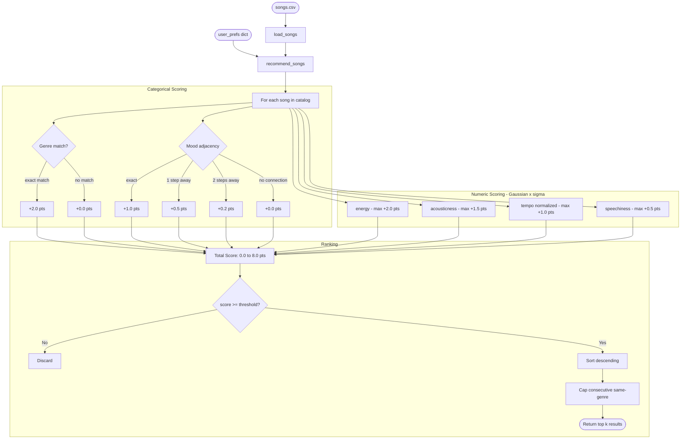
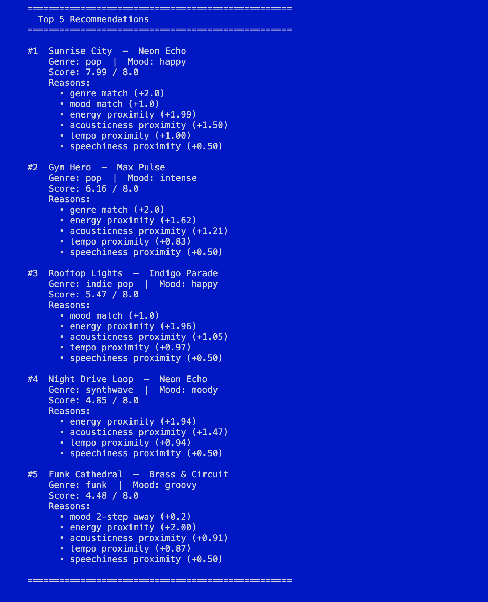
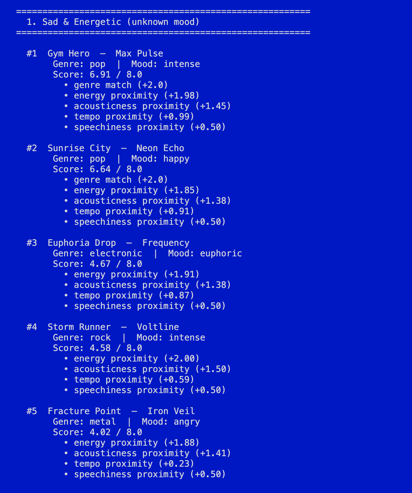
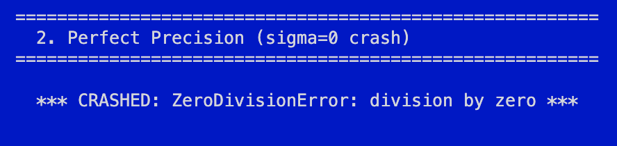
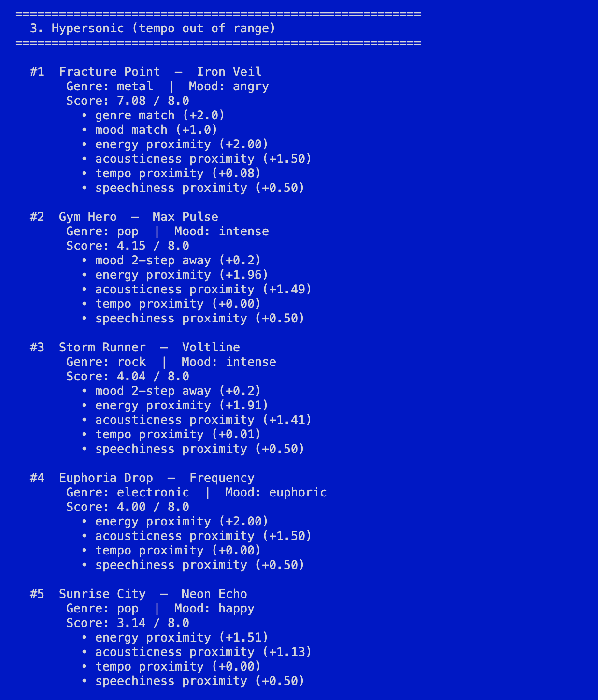

# 🎵 Music Recommender Simulation

## Project Summary

A scoring based music recommender that ranks a 20 song catalog against a user Taste profile using genre matching, Mood adjacency, and Gaussian proximity across four audio features.<br>

Built to explore how small design decisions like a single point bonus can quietly shape every result.<br>

See the [Model Card](model_card.md) for a full breakdown of how it works, what it gets right, and where it fails.

---

## How The System Works

Music recommenders today, like Spotify work by converting songs and users into vectors of features, then finding songs whose vectors are closest to what the user has responded to before. This simulation follows the same idea at a smaller scale. Rather than treating every feature equally, this version prioritizes **vibe matching** — it uses mood as the primary signal (with adjacency instead of binary matching), then refines results using two derived axes: *texture* (how dense and electronic a song feels) and *activity level* (how much energy it demands from the listener). Scores are computed with a Gaussian proximity function so that songs slightly off-preference are penalized gently, and the tolerance window (σ) is tuned per user to handle niche or broad tastes.

### Song Features

| Feature | Type | Role in Scoring |
|---|---|---|
| `mood` | categorical | Primary vibe driver — adjacency-scored, not binary |
| `genre` | categorical | Soft bonus signal |
| `energy` | numeric (0–1) | Gaussian proximity to `target_energy` |
| `tempo_bpm` | numeric (60–152) | Gaussian proximity to `target_tempo_bpm` (normalized) |
| `acousticness` | numeric (0–1) | Gaussian proximity to `target_acousticness` |
| `speechiness` | numeric (0–1) | Gaussian proximity to `target_speechiness` |
| `instrumentalness` | numeric (0–1) | Stored on Song; informs future scoring extensions |

### Taste Profile (UserProfile / `user_prefs` dict)

The taste profile is a dictionary of target values the recommender scores each song against. It can be constructed manually or derived from a seed song.

```python
user1 = {
    "preferred_mood":     "intense",   # drives mood adjacency
    "preferred_genre":    "rock",      # drives genre bonus
    "target_energy":       0.93,       # Gaussian scored
    "target_tempo_bpm":    152,        # Gaussian scored (normalized)
    "target_acousticness": 0.10,       # Gaussian scored
    "target_speechiness":  0.06,       # Gaussian scored
    "sigma":               0.15        # tolerance window — tighter = pickier
}
```

### How a Score is Computed

Each song is scored on a **0 – 8.0 point scale**. Categorical features award fixed bonus points; numeric features use a Gaussian proximity function centered on the user's target value, scaled by `sigma`.

```
genre match       exact: +2.0  |  no match: +0.0
mood adjacency    exact: +1.0  |  1 step: +0.5  |  2 steps: +0.2  |  none: +0.0
energy            Gaussian(σ)  →  max +2.0
acousticness      Gaussian(σ)  →  max +1.5
tempo (norm.)     Gaussian(σ)  →  max +1.0
speechiness       Gaussian(σ)  →  max +0.5
                               ──────────────
                  Max total:        8.0 pts
```

**Mood adjacency map** (all 16 moods in catalog):
```
euphoric ── happy ── uplifted ── groovy
              │                     │
           relaxed ── romantic ── bittersweet
              │
           chill ── nostalgic ── peaceful
              │
           focused ── moody ── melancholic
              │          │
           intense ── dark ── angry
```

### System Sketch

```
[user_prefs dict] ──────────────────────────────┐
                                                 │
[songs.csv] ──► [load_songs()] ──► [Song list]  │
                                        │        │
                                        ▼        ▼
                                   [recommend_songs()]
                                        │
                                        │  for each song:
                                        │  score = Σ weighted feature proximity
                                        ▼
                                   [scored list]
                                        │
                                        ├─ drop score < 0.40
                                        ├─ sort descending
                                        ├─ cap consecutive same-genre
                                        └─ return top k results
```

### Algorithm Recipe



### Potential Biases

Because genre carries the single largest point bonus (+2.0), the recipe will consistently under-rank songs that are a strong emotional and sonic match but happen to sit in a different genre — a lofi user might never see an ambient song even though the two are nearly identical in energy, acousticness, and mood. Mood labels introduce a different kind of bias: "intense" scores the same whether it belongs to a rock track or an EDM drop, so the system cannot distinguish between those two very different listening experiences without genre doing extra work it was not designed for. Speechiness is effectively a dead feature for most profiles since every genre except hip-hop and trap clusters in the 0.02–0.07 range, meaning it rarely shifts a song's score in any meaningful direction. Finally, the catalog itself reflects a narrow cultural window — it covers Western genres almost exclusively, so any user whose taste gravitates toward Afrobeats, bossa nova, or K-pop will receive poor recommendations not because the algorithm fails, but because the data was never representative of their taste to begin with.

<div align="center">
  <h3>CLI/Sample Output</h3>
  
</div>

---

## Getting Started

### Setup

1. Create a virtual environment (optional but recommended):

   ```bash
   python -m venv .venv
   source .venv/bin/activate      # Mac or Linux
   .venv\Scripts\activate         # Windows

2. Install dependencies

```bash
pip install -r requirements.txt
```

3. Run the app:

```bash
python -m src.main
```

### Running Tests

Run the starter tests with:

```bash
pytest
```

You can add more tests in `tests/test_recommender.py`.

---

## Experiments You Tried

*Adversarial profiles were designed to find the edges of the scoring logic (inputs that are technically valid but reveal unexpected or broken behavior).*

<div align="center">
  <h4>Sad &amp; Energetic — Unknown Mood</h4>
  <p>Setting <code>preferred_mood: "sad"</code> silently disables mood scoring entirely, since "sad" has no entry in the mood graph — every song scores 0 on that dimension and results are driven purely by genre and energy.</p>
  
</div>

<div align="center">
  <h4>Perfect Precision — Sigma Zero Crash</h4>
  <p>Setting <code>sigma: 0.0</code> causes a <code>ZeroDivisionError</code> the moment any Gaussian score is computed — the program crashes before returning a single result.</p>
  
</div>

<div align="center">
  <h4>Hypersonic — Out of Range Tempo</h4>
  <p>A target tempo of 220 BPM sits above the catalog ceiling of 168 BPM, so every song scores near zero on tempo proximity — the fastest song in the catalog (<em>Fracture Point</em>) still only earns +0.08 out of a possible +1.0.</p>
  
</div>

---

## Limitations and Risks

- A mood not in the graph (e.g. `"sad"`) silently scores zero on every song, skewing all results without warning
- The +2.0 genre bonus can rank a song in the top 3 even when it matches almost nothing else
- A target tempo outside the 52–168 BPM range makes tempo proximity near-zero for every song, quietly dropping an entire scoring dimension

---

## Reflection

[**Model Card**](model_card.md)

Building this made it clear that a recommender's blind spots are usually invisible from the output. It also revelas just how much thought goes into perfecting the algorithms and how much context matter in these systems. There could be a *million + 1* ways to tune a recommender, where the change in any single attribute in the algo can change the output drastically. I'm also greatful that I finally got to see the application of linear algebra in real projects. Before this I was stuck in abstraction hell reducing matricies thinking it's all for nothing, however this project brought me back down to earth, showing how cs coursework is actually practical and applicable, and not just all theory. 
